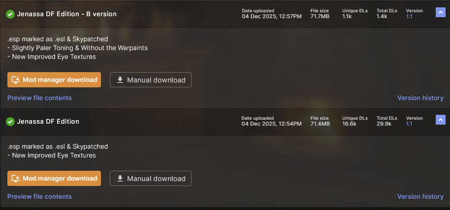
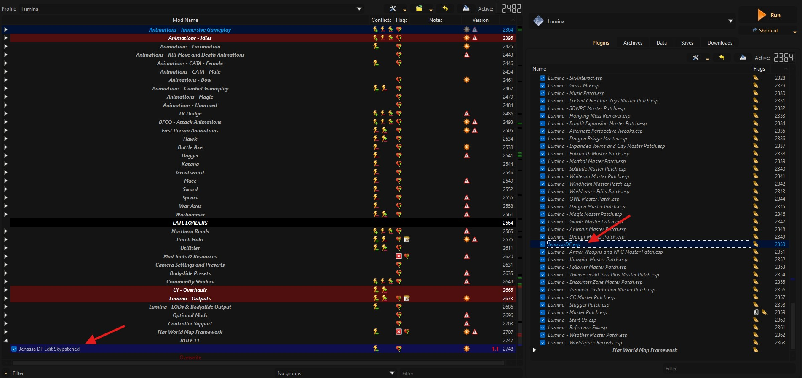
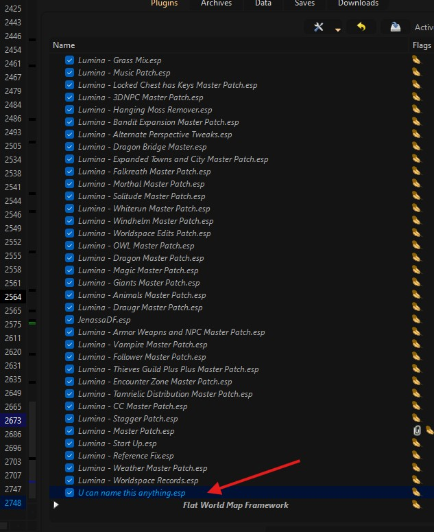
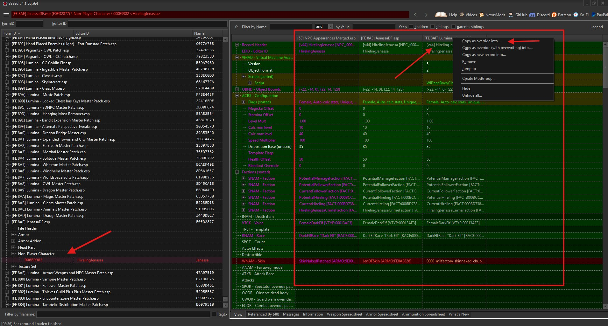
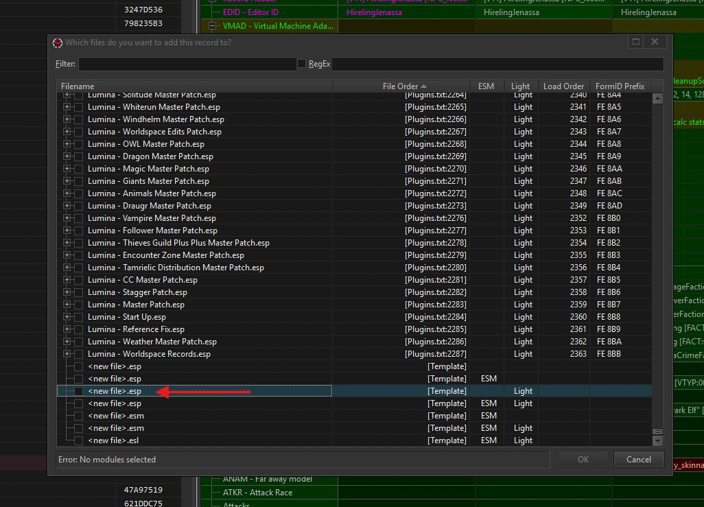
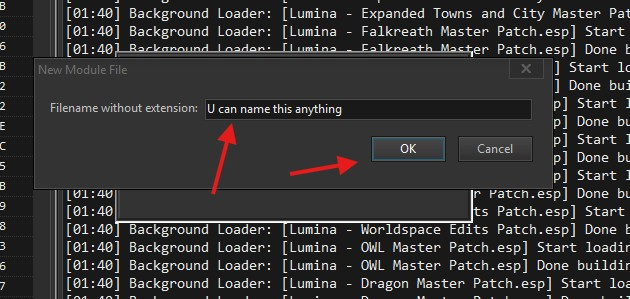
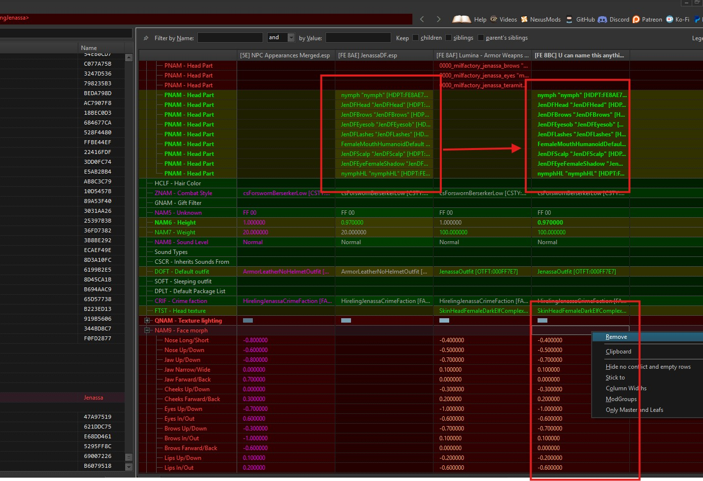
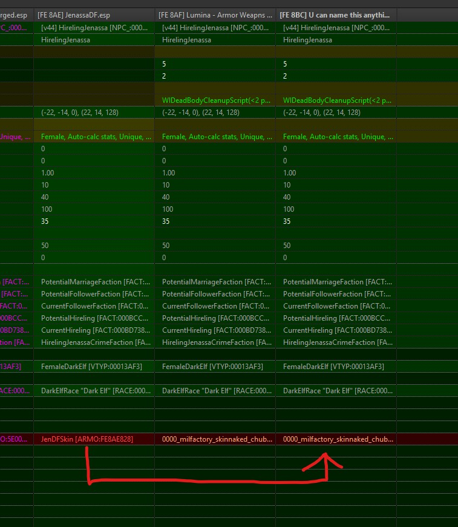
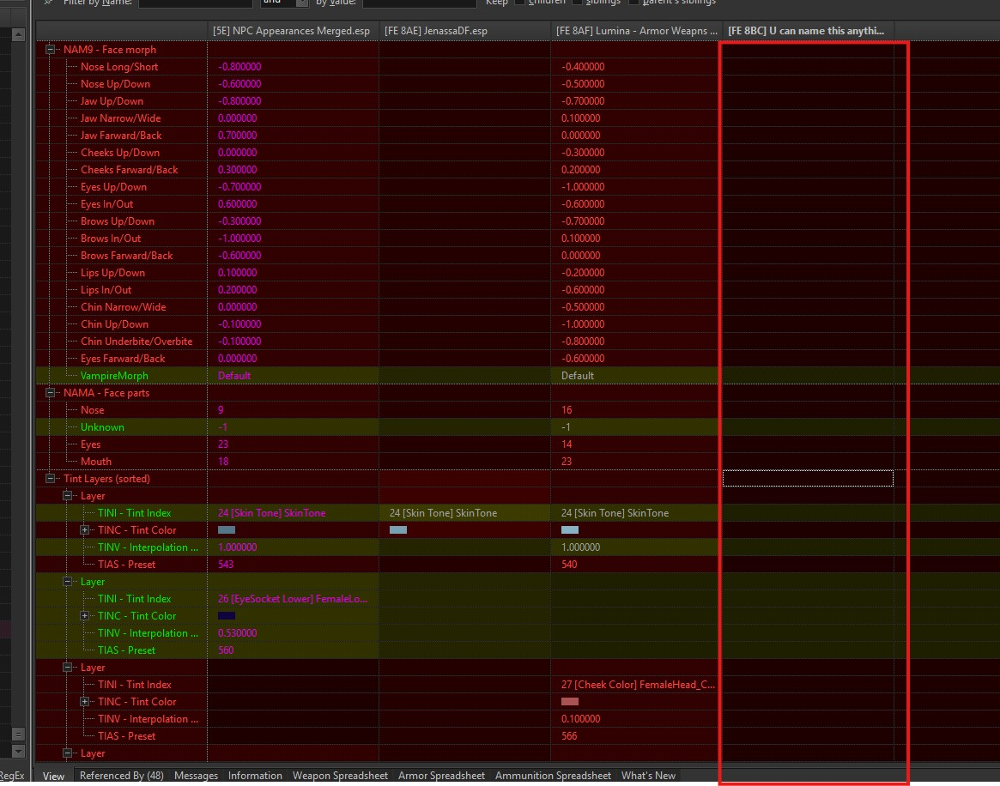

# Changing a Replacer

Part of **Rule 11**. Read the [Rule 11 disclaimer](#cache) before you start.

Lumina's base replacers live in `NPC Appearances Merged`. Swapping one means keeping Lumina's edits to that NPC and taking only the face from your replacer.

## Before you install anything

Lumina runs on **3BA**. Most replacers ship their own body and skin, which breaks it, so pick one that either brings no body of its own or is built for 3BA. If the FOMOD offers its own body or skin, do not take it.

## Check for a SkyPatcher version first

Lumina supports **SkyPatcher**. If the replacer has a SkyPatcher version, that is the whole job.

Install it normally, into the **Rule 11** separator like any other mod, then **re-generate the cache**. That is it. No plugin to position, no xEdit, no Synthesis.

[Jenassa DF Edition](https://www.nexusmods.com/skyrimspecialedition/mods/164775) is a good example. Its files page offers more than one version, and the description tells you which is which:

Take the SkyPatcher one, then skip to [re-generating the cache](#cache).

Installed, it sits at the bottom of the left pane under **RULE 11**:

## If there is no SkyPatcher version

You patch it yourself.

### 1. Install the replacer

Put the mod in the **Rule 11** separator. It sits below `Lumina - NPC Appearance Merge`, so your replacer's face files win over the merge.

### 2. Position the plugin

In the right pane, move the replacer's plugin so it loads **before** `Lumina - Armor Weapns and NPC Master Patch.esp`.

Your own patch, once you make it in the next step, goes at the very bottom, below every `Lumina - ` patch. Finished, the order looks like this:

### 3. Patch it in SSEEdit

Launch **SSEEdit** through MO2 and load the whole list. The mod groups window on startup does not matter here.

Filter to your replacer's plugin, then hover it and **alt-click** to expand everything at once. You want the **NPC record**. Armour and armour addon records may also show as conflicts, leave those alone.

Right-click the NPC record and choose **Copy as override into...**

In the file list, scroll to the bottom and pick the `<new file>.esp` row with the **Light** flag and nothing else. That is an ESP flagged as ESL. Never pick a row marked **ESM**, it makes your patch unusable.

Give it a name you will recognise. It can be anything.

Now bring the face across. Leave everything else as Lumina has it, that is where the outfit, perks, factions and stats live.

**Head parts.** Drag the whole `PNAM - Head Part` section over from your replacer. Forward all of it and leave it as it lands, do not try to make it match Lumina's.

**Skin.** `WNAM - Skin` is the skin row. Your new plugin inherits Lumina's skin from the master patch, so drag your replacer's across on top of it. Leaving Lumina's there puts the face and body on different textures, which is how you get a neck seam.

**Tint layers** come across the same way.

> [!WARNING]
> Yellow text means the value is identical to a master file. Do not force those rows green, that is the other way to end up with neck seams.

**Special case.** Now and then a row carried over from Lumina's patch fights your replacer and has to go rather than be replaced. Right-click it in your plugin and choose **Remove**. Most replacers will never need this.

Removed rows sit empty in your plugin, which is what you want. Your plugin is no longer saying anything about them, so the value beneath it applies.

Save and close SSEEdit.

### 4. Re-run Synthesis

Run **Synthesis** through MO2 so its patches rebuild against your new plugin. Run it after your plugin is in place, not before.

### 5. Re-generate the cache

You have changed files on disk. See [Cache](#cache).

> [!WARNING]
> Do not edit `Lumina - Armor Weapns and NPC Master Patch.esp` directly. A list update replaces it and your work is gone.

## If it comes out wrong

| What you see | Cause |
| --- | --- |
| Neck seam | The skin row still has Lumina's value, or you forwarded rows beyond head parts, tint and skin |
| Grey or ashen face | The mod is not in the Rule 11 separator, so the merge is still winning its face files |
| Body is wrong, or 3BA physics stop working | The replacer installed its own body. Reinstall it without one, or take its 3BA option |
| Face is right, behaviour is wrong | You kept the replacer's record instead of overriding Lumina's |
| No change at all | The replacer's plugin is loading after the master patch |
| Neck gap on an NPC you already met | The replacer changed their weight. Meet them on a fresh save |
